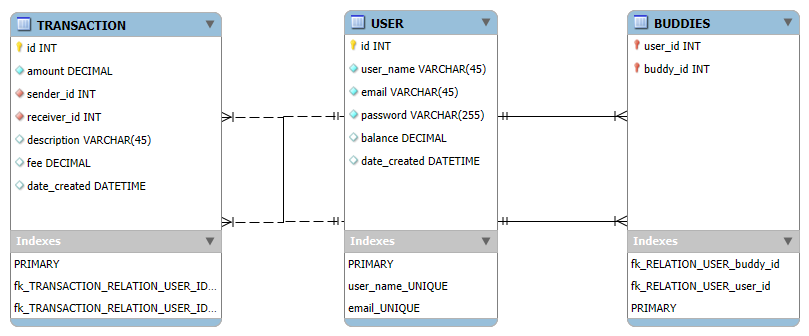

# PayMyBuddy - README

## Project Description

PayMyBuddy is a Spring Boot-based application designed for transactions between buddies. It provides several endpoints that allow users to interact with data about fire stations, medical records, and individuals in a community. The application also integrates unit testing, code coverage, and logging functionalities to ensure high quality and maintainability.

## MPD



## SQL Scripts

The SQL script for creating the database and tables can be found in [create_database.sql](./docs/sql_scripts/create_database.sql).
The SQL script for creating the database and tables for tests can be found in [create_test_database.sql](./docs/sql_scripts/create_test_database.sql).


## Documentation

- [Jacoco Documentation](https://GuillBuj.github.io/PayMyBuddy/jacoco/)
- [Surefire Documentation](https://GuillBuj.github.io/PayMyBuddy/surefire-reports/)
- [Javadoc](https://GuillBuj.github.io/PayMyBuddy/apidocs/)

## Technology Stack

- **Java 21**
- **Spring Boot**
- **Maven** 
- **JUnit** 
- **Jacoco**
- **Surefire** 
- **Spring Web** 
- **Thymeleaf**
- **Jackson** 
- **Mockito** 
- **Lombok**

## Prerequisites

- Java 21 or higher
- Maven

## Setup Instructions

1. **Clone the Repository**  
   Clone the repository to your local machine:
   ```bash
   git clone <repository_url>
   ```

2. **Install Dependencies**  
   Navigate to the project folder and install the required dependencies:
   ```bash
   cd <project_folder>
   mvn install
   ```

3. **Run the Application**  
   To run the application locally:
   ```bash
   mvn spring-boot:run
   ```

   The application will be accessible at [http://localhost:8080](/endpoint).


## Development Guidelines

- **Architecture**: MVC
- **SOLID Principles**: The code adheres to SOLID principles ensuring maintainability and scalability.
  
## Testing and Code Coverage

- **Unit Tests**: Unit tests are implemented using JUnit.
- **Code Coverage**: Jacoco is used to measure code coverage.
- **Test Reports**: Maven Surefire plugin generates detailed reports for the unit tests.